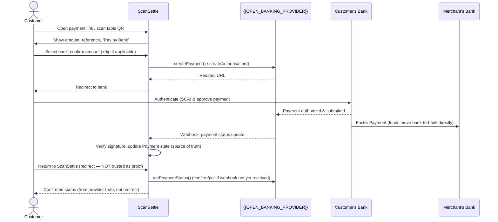
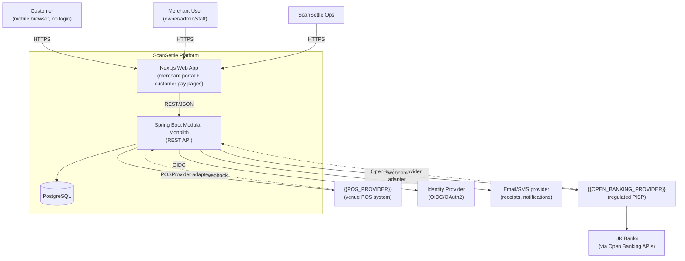
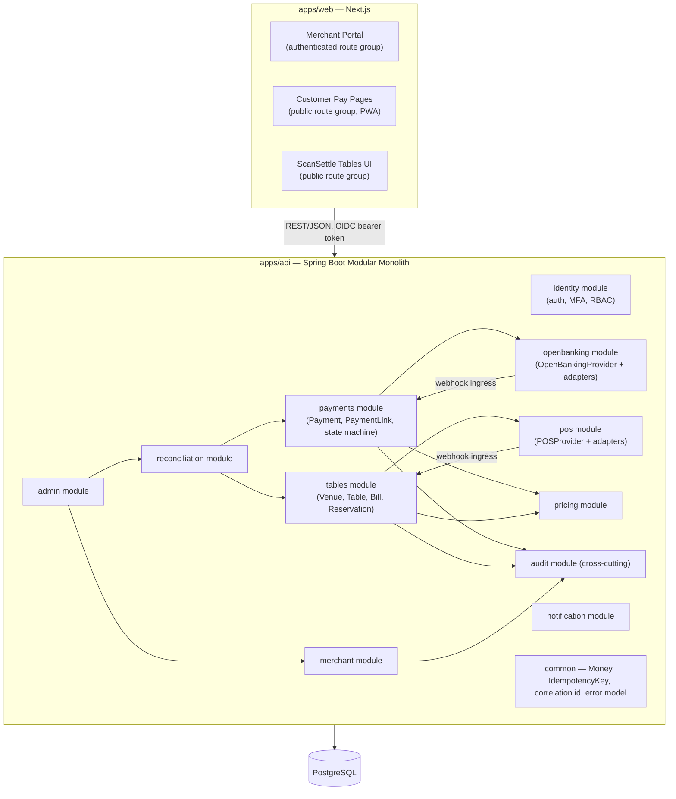

# ScanSettle — Architecture (Phase 0)

Status: DRAFT — awaiting Product Owner approval
Date: 2026-08-29

## 1. Executive Product Summary

ScanSettle is a UK Account-to-Account (A2A) payments platform built on Open Banking
Payment Initiation Services (PIS). It lets merchants get paid directly into their bank
account — bypassing card schemes — via a link, QR code, or a persistent hospitality
table QR. ScanSettle does not hold funds and is not itself the regulated PISP at MVP;
it orchestrates the experience and relies on an external regulated Open Banking
provider (`{{OPEN_BANKING_PROVIDER}}`) to actually move money.

Two initial markets, one platform:

- **High-value trade/professional payments** — invoice-style, single link, single
  payment, larger average value (e.g. £2,500 boiler installation).
- **Hospitality (ScanSettle Tables)** — persistent table QR, many small/split
  payments against a shared bill, tipping, concurrent payers.

Strapline: **"Pay by Bank, made simple."**
Hospitality: **"Scan. Split. Tip. Pay."**

## 2. Product Positioning

ScanSettle is deliberately positioned as an **orchestration and merchant-experience
layer**, not a bank, not a PISP, not a POS. Its defensible value is:

- Lower cost-of-acceptance than cards (0.35%, capped £2, vs typical 1.5–2.9% card
  processing).
- Faster settlement — funds land directly in the merchant's own account, same-day via
  UK Faster Payments, no card-acquirer holding period.
- A UX layer that hides Open Banking/PIS complexity behind "Pay by Bank" — no card
  entry, no app download, no registration for payers.
- A single platform that serves both one-off high-value trade payments and
  high-frequency, multi-payer hospitality bills — two different transaction shapes on
  one domain model.

The regulated payment initiation itself is deliberately treated as a swappable
dependency (Section 8), because provider commercial terms, bank coverage, and
reliability are expected to change over the product's life, and ScanSettle's own
future roadmap includes obtaining its own FCA permissions ([25] Future Design).

## 3. Scope

### In scope for MVP (v1)

- Merchant self-service registration, login, MFA, RBAC (OWNER/ADMIN/STAFF/READ_ONLY).
- ScanSettle Links + QR for one-off payments (trade/professional use case).
- ScanSettle Tables: persistent table QR, bill view, partial/split/custom payment,
  tipping, concurrent-payer safe settlement.
- Open Banking abstraction with a fully functional `MockOpenBankingProvider` (real
  provider integration deferred to Phase 5, on explicit instruction).
- POS abstraction with a fully functional `MockPOSProvider` (real POS integration
  deferred to Phase 7, on explicit instruction).
- Merchant dashboard: transactions, search, detail, status, basic reconciliation view.
- Refund *request* workflow (see Section 6 — regulatory constraint on what "refund"
  can mean for push payments).
- Admin/ops tooling: merchant visibility, webhook inspection, reconciliation,
  investigation (Phase 8).
- GBP only, decimal-safe money handling throughout.
- Audit logging of all payment-affecting actions.
- Multi-tenant isolation between merchants.

### Out of scope for MVP

As enumerated in the brief [24]: native mobile apps, card terminal/NFC tap-to-bank,
crypto/stablecoins/wallets, international/FX, cards, lending, loyalty, full POS,
kitchen/inventory management, Direct Debit, cVRP, recurring payments, Xero/QuickBooks,
marketplace payments. Not blocked architecturally — see [25].

## 4. Personas

| Persona | Who | Primary needs |
|---|---|---|
| **Trade Merchant Owner** ("Dave", sole-trader plumber/electrician) | Runs the business, does his own admin | Fast invoice → link → get paid, minimal admin overhead, sees money land |
| **Hospitality Owner/Manager** ("The Red Lion" manager) | Owns/manages a pub or restaurant, possibly multiple sites | Table payments work reliably under load (Friday night), staff can see bill status, reconciles against till at end of day |
| **Hospitality Staff** ("Ellie", bartender/waiter) | Front-of-house, low tech patience | Glance at a table's paid/remaining status, doesn't need financial admin access |
| **Merchant Admin/Bookkeeper** | Office manager, accountant | Transaction search, reconciliation exports, refund requests, audit trail |
| **Customer/Payer** | Anonymous, one-off | Fastest possible path to "paid", trusts it worked, never asked to register |
| **ScanSettle Ops/Support** | Internal | Investigate failed/stuck payments, inspect webhooks, support merchants, flag fraud |

## 5. Use Cases (representative, not exhaustive)

1. Trade merchant creates a £2,500 invoice payment request and shares a link/QR;
   customer pays by bank; merchant sees confirmed payment.
2. Merchant staff generates/reprints a table QR for Table 14.
3. Customer scans Table 14 QR, sees itemised bill and remaining balance, pays £40 of
   £120 by bank.
4. Two customers at the same table pay simultaneously; both succeed without the bill
   being over-committed.
5. Customer adds a 10% tip during Pay by Bank flow at a table.
6. Customer abandons the bank authentication step; the reserved amount is released
   back to the bill after a timeout.
7. Merchant admin searches transactions by date range/status/reference and exports a
   reconciliation view.
8. Merchant requests a refund on a completed payment; system records a refund request
   and (per Section 6) a manual/second-payment fulfilment path.
9. Open Banking provider sends a delayed/duplicate webhook; system processes it
   idempotently with no double-confirmation.
10. Merchant owner invites a staff member with STAFF role; staff member cannot access
    bank account settings or refunds.
11. ScanSettle ops investigates a payment stuck in `PAYMENT_SUBMITTED` for over 15
    minutes via the webhook/provider-transaction inspector.

## 6. Functional Requirements (summary)

- FR1: Merchants can create, view, search, and filter payments and payment links.
- FR2: Payment links render a mobile-first, no-login customer payment page.
- FR3: Customers can select a bank from a supported-bank list and complete Pay by
  Bank without ScanSettle ever seeing or storing bank credentials.
- FR4: Payment status shown to the customer/merchant must be derived only from
  provider-confirmed state (API poll or webhook), never from browser redirect alone.
- FR5: Tables support persistent QR → live bill view → partial/split/custom payment
  with tipping.
- FR6: Concurrent payment attempts against the same bill must never allow total
  committed payments to exceed the bill total, other than an explicit
  merchant-approved overpayment/goodwill scenario (not in MVP).
- FR7: All merchant users are scoped to exactly one merchant (tenant) and RBAC role;
  cross-tenant data access must be structurally prevented, not just filtered in the UI.
- FR8: Every payment-affecting state change produces an audit event.
- FR9: Webhook ingestion (Open Banking and POS) must be idempotent, signature-verified,
  and replay-resistant.
- FR10: Refund is modelled as a request/record; actual fund movement is a merchant
  bank-initiated action (Section 6/decisions), not an automatic reversal.
- FR11: Fees (0.35%, capped £2) are calculated and recorded per successful payment,
  attributable to the merchant's pricing plan, without requiring a billing engine.

## 7. Non-Functional Requirements

| Category | Requirement (MVP target) |
|---|---|
| Availability | 99.9% during business hours (07:00–23:00 UK) for customer payment path; best-effort outside |
| Latency | Customer payment page interactive < 2s on 4G; API p95 < 400ms excl. provider round-trip |
| Scalability | Stateless app instances behind a load balancer; Postgres vertical scale sufficient for MVP volumes; modular monolith must not require a rewrite to split a module out later |
| Consistency | Financial state changes are transactional; money amounts are integer minor units (pence) with explicit currency, never floating point |
| Auditability | Every payment/bill/bank-account mutation is attributable, timestamped, and immutable once written |
| Observability | OpenTelemetry traces/metrics/logs; a single correlation ID threads customer request → API → webhook processing |
| Data retention | Financial records retained 7 years (assumption, Section 12) |
| Multi-tenancy | Every query scoped by merchant_id; tested explicitly (Section 21) |
| Accessibility | Customer payment journey meets WCAG 2.1 AA at minimum (large tap targets, contrast, screen-reader labels) |
| Localisation | English (UK) only, GBP only, for MVP |

## 8. Regulatory Assumptions

These are assumptions, not confirmed legal positions — flagged as risks requiring
sign-off before go-live (see Risks, Section 15):

1. ScanSettle is **not** itself authorised for Payment Initiation Services at MVP. It
   operates as a technology/agent layer under a commercial and (where required)
   regulatory arrangement with `{{OPEN_BANKING_PROVIDER}}`, who holds the FCA
   authorisation. The exact legal characterisation (agent of the PISP, introducer,
   or similar) must be confirmed per the eventual provider's contract — this affects
   what ScanSettle is permitted to say/do (e.g. whether it can touch payment
   instructions at all, or only orchestrate redirects).
2. **Refunds are not a native capability of Open Banking push payments.** Unlike
   cards, there is no scheme-level reversal. A "refund" is, in practice, the merchant
   authorising a *new* outbound payment back to the customer, which itself requires
   either (a) the merchant doing this manually via their own banking, or (b) a
   Payment *initiation* capability that pays *out* from the merchant (a materially
   different, and more sensitive, regulatory surface than paying in). MVP scope is
   **refund request tracking only** — see ADR-0004. This must be communicated
   accurately to merchants (no promise of automatic/instant refund).
3. No card data is ever handled, so PCI-DSS is out of scope — a genuine product
   advantage worth stating explicitly to merchants and in due-diligence conversations.
4. UK GDPR / Data Protection Act 2018 applies to merchant and any incidental customer
   PII (e.g. an email a customer optionally provides for a receipt). Minimise: no
   requirement to identify customers, so no persistent Customer entity is proposed
   (Section domain-model.md).
5. FCA Consumer Duty expectations may flow down contractually from the Open Banking
   provider even though ScanSettle is not itself regulated — assume the UX must meet
   "fair value" and "consumer understanding" bars (plain-English fees, clear status,
   no dark patterns) regardless of formal regulatory scope.
6. Strong Customer Authentication (SCA) is the bank's responsibility during the
   Open Banking redirect; ScanSettle must not attempt to capture or influence bank
   credentials or SCA steps.

**Action required:** legal/compliance review of the actual provider agreement once
`{{OPEN_BANKING_PROVIDER}}` is selected (Phase 5 gate).

## 9. Payment Funds-Flow



Key point: **money never touches ScanSettle or `{{OPEN_BANKING_PROVIDER}}`'s own
account** — Faster Payments moves funds directly bank-to-bank. ScanSettle only ever
holds *state about* the payment, never the funds.

## 10. High-Level Architecture (System Context)



## 11. Container / Component View



Modules communicate in-process via well-defined Java interfaces/application services
(no HTTP hops between modules). Each module owns its own package and its own tables;
cross-module reads go through the owning module's service layer, never direct
cross-module repository access — this is what keeps a future extraction to a separate
service viable without a rewrite.

## 12. Technology Decisions

| Layer | Choice | Notes |
|---|---|---|
| Frontend | Next.js + React + JavaScript (no TypeScript), one app, two route groups (merchant portal, public pay/tables) | Single deployable, shared design system; avoids running two frontends for MVP. Per explicit instruction — JavaScript only, no TS. Compensating controls: PropTypes (or JSDoc + `checkJs` for editor-level hints without a build-time TS toolchain) on shared components, and strong runtime validation at the API boundary (Zod/Yup) since there's no compile-time type checking against the backend's contracts |
| Backend | Java 21+, Spring Boot, modular monolith, package-by-feature | Per brief; avoids premature microservices |
| API style | REST/JSON, RFC 7807 Problem Details for errors | See api.md |
| Database | PostgreSQL, single schema, module ownership enforced in code not DB schema | Simpler ops for MVP; can be schema-per-module later without app rewrite if needed |
| Migrations | Flyway | Simpler operational model than Liquibase for a single-team MVP |
| Identity | OIDC/OAuth2-compatible provider for merchant auth; MFA via TOTP at minimum | Provider TBD — placeholder, not hardcoded |
| Containerisation | Docker, docker-compose for local dev | |
| Cloud | Cloud-agnostic (no cloud-specific SDKs in domain/app layers) | |
| IaC | Terraform (from Phase 10) | |
| CI/CD | GitHub Actions | |
| Observability | OpenTelemetry (traces, metrics, logs), correlation ID propagation | |
| Testing | JUnit5, Testcontainers (Postgres), REST-assured/MockMvc for API, contract tests for provider adapters, Playwright (or similar) for E2E | |

**Decision needing approval:** no Redis/cache layer is introduced for MVP. Reservation
TTLs (Section 23 concurrency) and rate limiting are implemented with Postgres
(expiry timestamp columns + a scheduled sweep) rather than a new infra dependency,
consistent with "avoid unnecessary" components. If load testing later shows this
insufficient, that will be raised as an explicit change request, not introduced
silently.

## 13. Proposed Repository Structure

```
/apps
  /web                 Next.js app (merchant portal + customer/table public pages)
  /api                 Spring Boot modular monolith
    /src/main/java/com/scansettle
      /identity
      /merchant
      /payments
      /openbanking
        /adapter/{{OPEN_BANKING_PROVIDER}}   (Phase 5 only)
      /tables
      /pos
        /adapter/{{POS_PROVIDER}}            (Phase 7 only)
      /reconciliation
      /admin
      /audit
      /notification
      /pricing
      /common
/docs
  architecture.md
  domain-model.md
  api.md
  security.md
  open-banking.md
  pos-integration.md
  payment-states.md
  scansettle-tables.md
  deployment.md
  operations.md
  branding.md
  /decisions            ADRs
/infra
  /terraform
  docker-compose.yml
/.github/workflows
```

## 14. Risks

| # | Risk | Impact | Mitigation |
|---|---|---|---|
| R1 | Legal characterisation of ScanSettle's role relative to the PISP is unconfirmed | Could constrain what the product is allowed to do/say | Legal review gated before Phase 5 |
| R2 | "Refund" expectation mismatch with merchants/customers | Complaints, trust damage, potential regulatory complaint | Explicit UX language ("refund request", not "refund"), ADR-0004, merchant education |
| R3 | Concurrency bugs in Tables under real Friday-night load | Overpayment or false-decline, direct financial/trust harm | Reservation-based design (Section 23), explicit concurrency test suite in Phase 6 |
| R4 | Provider webhook unreliability (delay, duplication, loss) | Stuck/incorrect payment states | Idempotent webhook processing, active status polling as backstop, ops tooling to investigate |
| R5 | Single Postgres instance as a scaling/availability bottleneck | Outage or slowdown at scale | Acceptable for MVP; documented as a known limit, revisit at Phase 10 |
| R6 | Provider lock-in despite abstraction, if adapter design leaks provider concepts | Costly to switch provider later | Strict rule: no provider types in domain layer; contract tests against the interface, not the vendor SDK |
| R7 | MFA/RBAC gaps allow staff-level users excessive access (e.g. to bank account changes) | Fraud, unauthorised bank redirection | RBAC permission matrix defined before Phase 3 build, tested per role |

## 15. Assumptions

- Single currency (GBP), single country (UK) for MVP.
- Merchants have a single UK business bank account per merchant for MVP (multiple
  accounts per merchant deferred).
- No persistent Customer/payer identity is required or desirable for MVP (Section 8 —
  data minimisation; also simplifies GDPR posture).
- A hospitality merchant may operate more than one venue/site under one merchant
  account (Section domain-model.md, Venue entity) — this is a proposed addition, not
  in the original entity list; flagged for approval.
- Financial record retention of 7 years, pending confirmation against actual UK
  accounting/AML retention obligations for this product's contractual position.
- Business hours availability target (99.9%) is acceptable for MVP; 24/7 payment
  processing is not a hard requirement for launch (most trade/hospitality use is
  daytime/evening UK hours).

## 16. Out of Scope (restated)

Per Section 24 of the brief — not built, and not designed around, unless the
"Future Design" hooks in Section 25 are explicitly exercised in a later phase.
