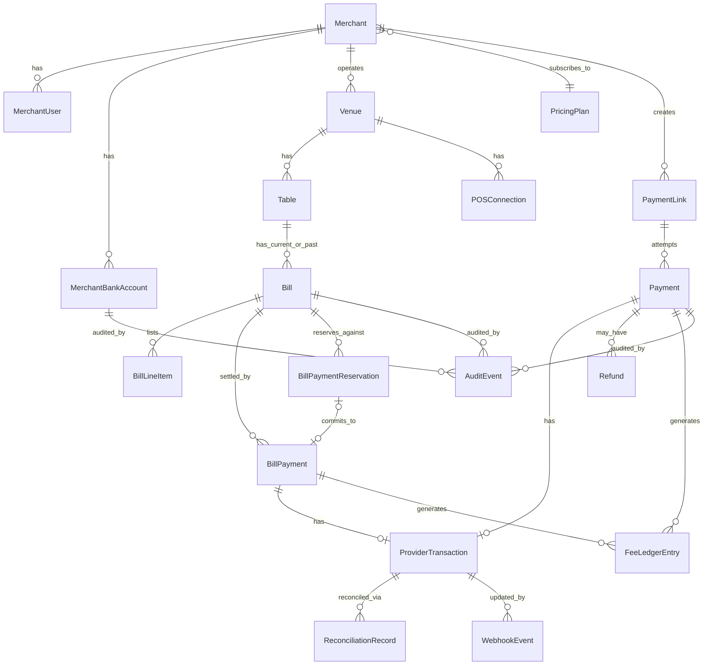

# ScanSettle — Domain Model (Phase 0)

Status: DRAFT — awaiting Product Owner approval

## 1. Approach

The brief supplied a starter entity list and explicitly invited analysis rather than
literal acceptance. This document proposes deliberate deviations, each with a reason,
and asks for approval where the deviation changes scope or schema shape (per Working
Rule 27).

## 2. Proposed changes to the starter entity list

| Change | What & why |
|---|---|
| **Split `Payment` into `PaymentLink` (reusable request) and `Payment` (a single attempt/transaction)** | A merchant's £2,500 invoice link may be opened, abandoned, and retried by the customer more than once (e.g. picks a bank, fails SCA, tries again). Treating the link as the durable, shareable object and each attempt as a `Payment` avoids conflating "the thing I sent the customer" with "one attempt to pay it", and makes retry/expiry logic clean. `Payment.paymentLinkId` is nullable — a payment can also exist without a link (e.g. table bill payments, which reference a `Bill` instead). |
| **Drop `QRCode` as a persistent entity** | A QR code is a rendering of a URL (a `PaymentLink` or `Table` URL). It has no independent lifecycle or state worth persisting — generating it on demand (and cache the image, not a DB row) is simpler and avoids stale-QR bugs. Replaced by a stateless QR-generation utility in the payments/tables modules. |
| **Drop standalone `Tip` entity; fold into `BillPayment`** | A tip is always 1:1 with exactly one `BillPayment` and never has independent state or lifecycle. Modelled as `BillPayment.tipAmount` + `BillPayment.tipMethod` (NONE / PERCENT_5 / PERCENT_10 / CUSTOM). Still fully reportable/reconcilable (Section 6 of the brief) via a query, without a needless join table. |
| **Add `Venue`** (not in the original list) | Hospitality merchants commonly operate more than one site (a pub group, a small restaurant chain) under one merchant account, each with its own tables and its own POS connection. Without `Venue`, `Table` would have to belong directly to `Merchant`, which breaks the moment a merchant has two locations. For trade merchants, a single implicit `Venue` per `Merchant` is created transparently — no UX change for that persona. **This is a schema decision made now to avoid a breaking migration later — flagged for explicit approval.** |
| **Rename `POSIntegration` → `POSConnection`, scope to `Venue`** | Tightens the concept: it's a specific POS provider's credentials/config for one venue, not an abstract "integration". |
| **Add `BillPaymentReservation`** (not in the original list) | This is the mechanism that makes Section 23's concurrency guarantee real — see scansettle-tables.md. Without it, "prevent accidental overpayment" is a UX hope, not an enforced invariant. |
| **Add `FeeLedgerEntry`** | One row per successful `Payment`/`BillPayment` recording the calculated platform fee (0.35%, capped £2) against the merchant's plan at the time. Keeps Section 11's future-plan flexibility real (different plans/fee schedules don't require reprocessing historic payments) and gives reconciliation and future billing a clean source. |
| **Add `IdempotencyKey`** | Generic table backing the `Idempotency-Key` header on mutating POSTs (`/payments`, `/bills/{id}/payments`), independent of any one module. |
| **`Refund` scoped down for MVP** | See ADR-0004: `Refund` is a *request/record* entity (status: REQUESTED, APPROVED, MANUALLY_SETTLED, DECLINED) — it does not model or trigger an automatic reversal, because Open Banking push payments have no scheme-level reversal. It exists to give merchants and ops a trackable, auditable record while the actual money movement happens outside ScanSettle (merchant's own banking) for MVP. |
| **No `Customer` entity** | Customers don't register (Section 9 of the brief). Optional payer contact info (e.g. an email for a receipt) is captured as plain fields on `Payment`/`BillPayment`, not a durable identity — minimises PII per Section 8 of architecture.md. |
| **`Merchant.verificationStatus` instead of a separate KYB entity** | Real KYB/business-verification integration is out of scope for MVP (no provider named in the brief). A status enum (`UNVERIFIED`, `PENDING`, `VERIFIED`, `REJECTED`) plus audit events covers the brief's "business verification status" requirement without inventing an unbuilt subsystem. |

## 3. Entity Reference

### Core / Merchant

- **Merchant** — id, legalName, tradingName, businessType, verificationStatus,
  pricingPlanId, createdAt, status (ACTIVE/SUSPENDED).
- **MerchantUser** — id, merchantId, email, passwordHash (or IdP subject), role
  (OWNER/ADMIN/STAFF/READ_ONLY), mfaEnabled, status.
- **MerchantBankAccount** — id, merchantId, sortCode (encrypted), accountNumber
  (encrypted), accountName, verified, status, changeAuditTrail (via AuditEvent).
- **Venue** — id, merchantId, name, address, timezone. (One implicit Venue is
  auto-created for trade merchants.)

### Payments (trade/professional)

- **PaymentLink** — id, merchantId, amount, currency, description, reference,
  status (ACTIVE/EXPIRED/CLOSED), expiresAt, createdBy.
- **Payment** — id, merchantId, paymentLinkId (nullable), billPaymentId (nullable —
  mutually exclusive with paymentLinkId), amount, currency, state (Section
  payment-states.md), payerContact (optional, unstructured), idempotencyKey,
  createdAt, updatedAt.
- **ProviderTransaction** — id, paymentId, provider, providerReference, rawStatus,
  lastSyncedAt. The only place provider-specific identifiers live.
- **Refund** — id, paymentId, requestedBy, amount, status, note, resolvedAt.

### ScanSettle Tables (hospitality)

- **Table** — id, venueId, label ("Table 14"), qrToken (opaque, rotatable), status
  (ACTIVE/INACTIVE).
- **Bill** — id, venueId, tableId, posReference (nullable, from POS if integrated),
  lineItems (JSON or child table — see below), totalAmount, currency, state
  (bill-state-machine), openedAt, closedAt.
- **BillPayment** — id, billId, contributionAmount, tipAmount, tipMethod,
  totalAuthorisedAmount (= contribution + tip), state, payerContact (optional),
  createdAt.
- **BillPaymentReservation** — id, billId, requestedAmount, status
  (ACTIVE/COMMITTED/RELEASED/EXPIRED), expiresAt, billPaymentId (set on commit).
- **POSConnection** — id, venueId, provider, status, config (credentials via secret
  refs, not inline).

*Bill line items*: for MVP, line items are display-only (populated either from
`MockPOSProvider`/`{{POS_PROVIDER}}` or manual merchant entry) and are not a
transactable domain concept — customers pay against the bill *total*, not individual
items (per the brief's split/partial/custom model, not itemised ordering). Modelled as
a simple child table (`BillLineItem`: billId, description, amount) for display and
reconciliation only.

### Cross-cutting

- **WebhookEvent** — id, source (OPEN_BANKING/POS), provider, providerEventId
  (unique with provider, for replay protection), signatureValid, payload, receivedAt,
  processedAt, processingResult.
- **ReconciliationRecord** — id, paymentId or billPaymentId, providerTransactionId,
  expectedAmount, confirmedAmount, matched (bool), discrepancyNote.
- **AuditEvent** — id, merchantId (nullable for ops actions), actorType (MERCHANT_USER/
  CUSTOMER/SYSTEM/OPS), actorId, action, entityType, entityId, beforeState, afterState,
  correlationId, occurredAt. Append-only.
- **PricingPlan** — id, code (FREE/PRO/HOSPITALITY/ENTERPRISE/BASIC), feePercentage,
  feeCapAmount, monthlySubscriptionAmount, active.
- **FeeLedgerEntry** — id, paymentId or billPaymentId, merchantId, pricingPlanId,
  calculatedFeeAmount, createdAt.
- **IdempotencyKey** — key, merchantId, endpoint, requestHash, responseSnapshot,
  createdAt.

## 4. Preliminary ERD

## 5. Open Questions

1. Approve or reject the `Venue` addition (schema decision now vs. costly migration
   later).
2. Approve the reduced `Refund` scope (request/record, not automatic reversal) — see
   ADR-0004.
3. Confirm 7-year retention assumption for financial records (architecture.md
   Section 15) — affects `AuditEvent`/`WebhookEvent` retention/archival design later.
