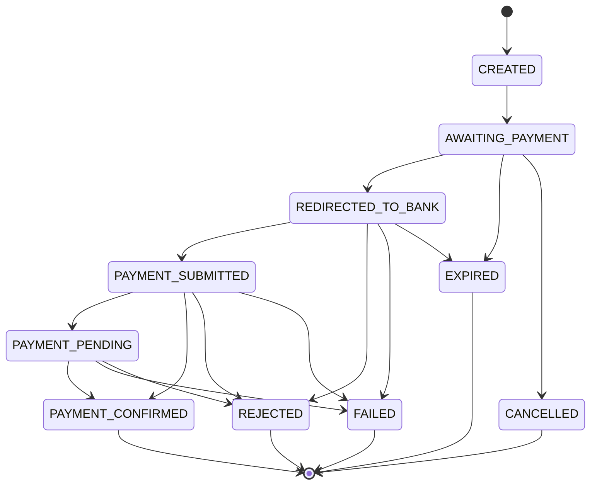
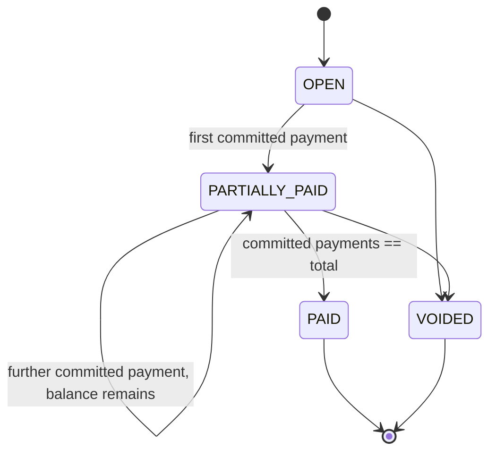

# ScanSettle — Payment & Bill State Machines (Phase 0)

Status: DRAFT — awaiting Product Owner approval

## 1. Payment State Machine

The brief's starter list of 11 states is refined to 10, merging two pairs of states
that most Open Banking providers cannot reliably distinguish via webhook (so keeping
them separate would create states ScanSettle can never actually observe transitions
into/out of with confidence), and adding explicit terminal/non-terminal
classification.

### Proposed states

| State | Terminal? | Meaning |
|---|---|---|
| `CREATED` | No | Payment record created server-side (link generated / bill-payment attempt initiated), not yet shown to or acted on by the customer |
| `AWAITING_PAYMENT` | No | Customer is actively viewing the pay page |
| `REDIRECTED_TO_BANK` | No | Customer selected a bank and was redirected for authentication *(merges the brief's `BANK_SELECTED` + `AUTHENTICATION_STARTED` — from ScanSettle's vantage point these happen in one client redirect with no independent, reliable server-observable event between them for most providers)* |
| `PAYMENT_SUBMITTED` | No | Provider confirms the customer completed authentication and the payment has been submitted into the banking rail *(equivalent to the brief's `PAYMENT_INITIATED`, renamed for clarity)* |
| `PAYMENT_PENDING` | No | Provider reports the payment is submitted but not yet confirmed settled (used only for providers/rails where confirmation isn't near-instant) |
| `PAYMENT_CONFIRMED` | **Yes** | Provider has confirmed the payment completed — source of truth is provider API/webhook, never the browser redirect |
| `FAILED` | **Yes** | Technical failure (provider error, timeout) |
| `REJECTED` | **Yes** | Bank or customer declined (e.g. insufficient funds, SCA failed, customer declined at bank) |
| `CANCELLED` | **Yes** | Customer or merchant explicitly cancelled before completion |
| `EXPIRED` | **Yes** | No terminal outcome reached before the link/session TTL elapsed |

### Diagram

### Governing rules

- The *only* trusted transition into `PAYMENT_CONFIRMED` is a verified provider
  webhook or an authenticated `getPaymentStatus()` call — never the customer's
  browser landing back on a "success" URL.
- On browser return, ScanSettle actively calls `getPaymentStatus()` if no webhook has
  yet been received, rather than trusting the redirect outcome parameter.
- A scheduled reconciliation sweep polls any payment stuck in a non-terminal state
  past a threshold (e.g. 15 minutes) to catch missed webhooks.
- `Payment.state` transitions are enforced in code (illegal transitions rejected,
  logged as an audit anomaly) — not just a free-text status column.

**Decision flagged for approval:** the merge of `BANK_SELECTED`+`AUTHENTICATION_STARTED`
and the rename of `PAYMENT_INITIATED`→`PAYMENT_SUBMITTED`. If a future
`{{OPEN_BANKING_PROVIDER}}` *does* expose a reliable, independent "authentication
started" webhook, splitting `REDIRECTED_TO_BANK` back into two states is a low-cost
additive change at that point.

## 2. Bill State Machine

The brief's starter list includes a whole-bill `PAYMENT_PENDING` state. This is
**removed** at the bill level: with concurrent payers (Section 23), one customer's
payment can legitimately be pending while the bill remains open for others to pay the
*true* remaining (unreserved) balance. A bill-level `PAYMENT_PENDING` state would
incorrectly block other customers from paying while one payment is mid-flow.
"Pending" is tracked per `BillPaymentReservation`, not as a bill-blocking state — see
scansettle-tables.md.

`VOIDED` is added (distinct from `CANCELLED`) for staff-initiated bill voiding
(walkout, comped bill, POS correction) — an operational action, not a customer-driven
outcome.

### Proposed states

| State | Meaning |
|---|---|
| `OPEN` | Bill created, nothing paid yet |
| `PARTIALLY_PAID` | Some committed payments exist, remaining balance > 0 |
| `PAID` | Committed payments equal the bill total; remaining balance = 0 |
| `VOIDED` | Staff cancelled the bill outside the normal payment flow |

### Diagram

`Bill.remainingBalance` is a derived value:
`total − Σ(committed BillPayments) − Σ(active BillPaymentReservations)`.
See scansettle-tables.md for the concurrency mechanics behind this.

**Decision flagged for approval:** removing the bill-level `PAYMENT_PENDING` state
from the brief's list, in favour of reservation-level pending tracking.
